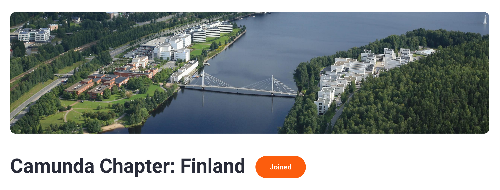

##

{width="85%"}

* **2024-06-12 @ 1400–1600 EEST:**
* BPMN ja pienet avuliaat elinkaariprosessit
* BPMN.io elementtimallit (*Element Templates*)

## {.standout}

::: columns
::: {.column width="40%"}
* Camunda
* Chapter:
* Finland
:::

::: {.column width="55%"}
{width="100%"}
:::
:::

## {.standout}

::: columns
::: {.column width="40%"}
* University of Jyväskylä
* 
* Digital Services
:::

::: {.column width="55%"}
{width="100%"}
:::
:::

## 2024-06-12 @ 1400–1600 CEST

::: columns
::: {.column width="48%"}
* 1400–
* **BPMN ja pienet avuliaat elinkaariprosessit**
* Asko Soukka, JY
* Pasi Anttonen, JY
:::

::: {.column width="48%"}
* 1500–
* **BPMN.io elementtimallit**
* Asko Soukka, JY
:::
:::

\vspace{0.5cm}

* 1530–
* **META ja keskustelua**
