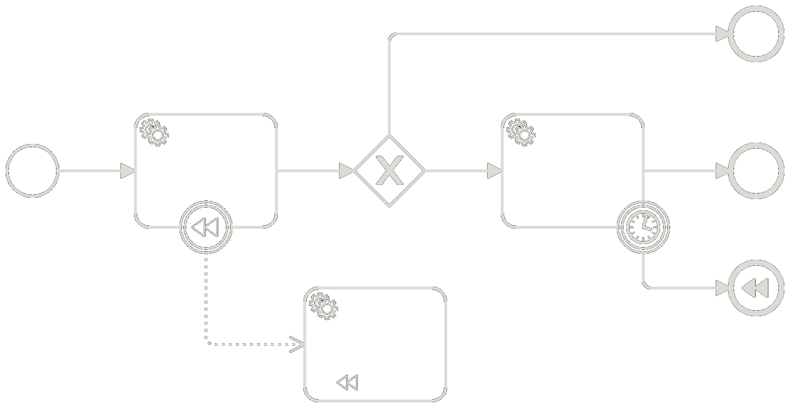
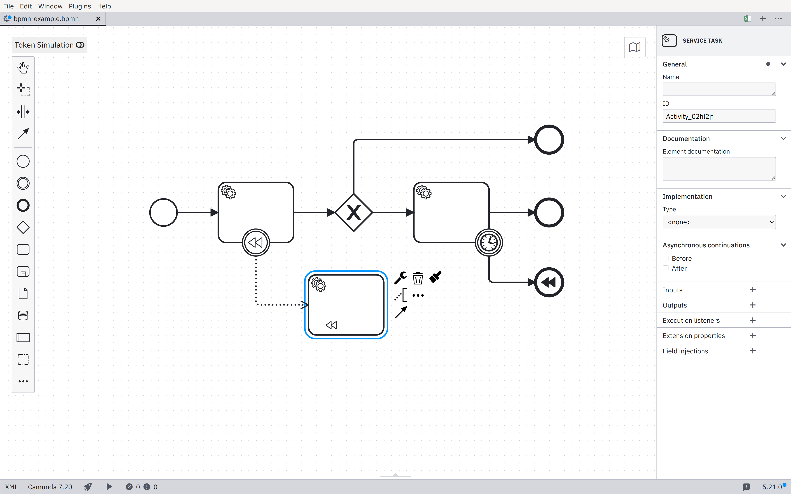
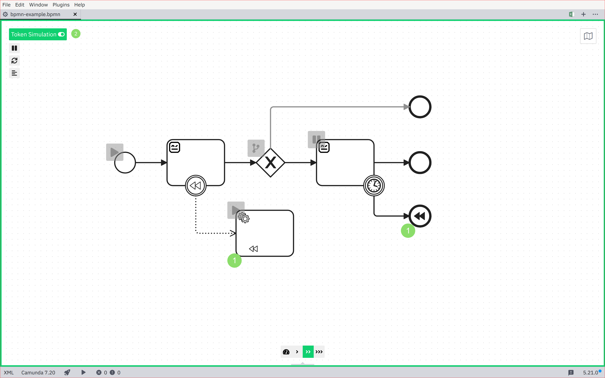
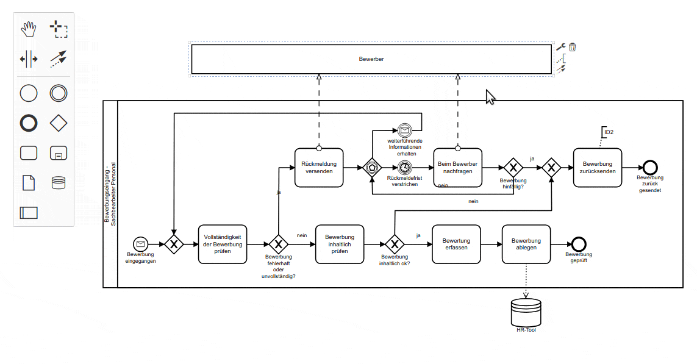
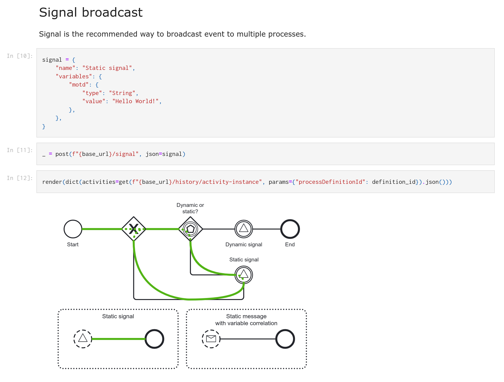
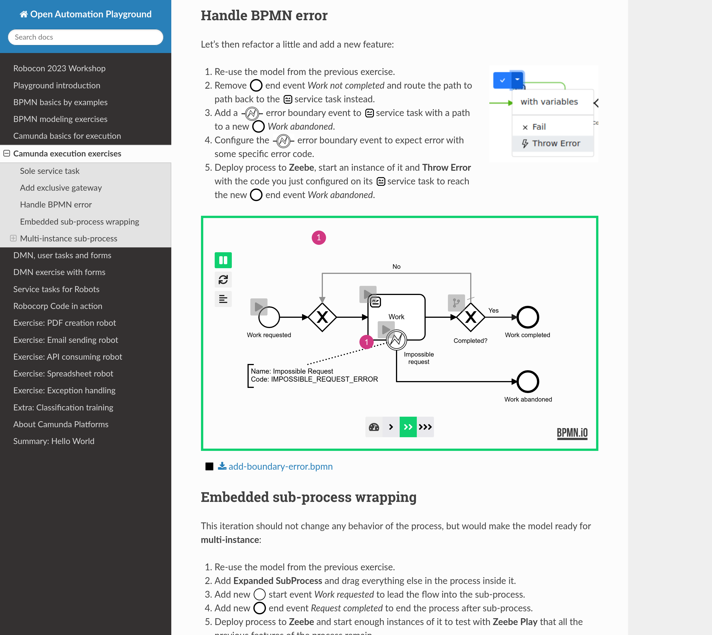
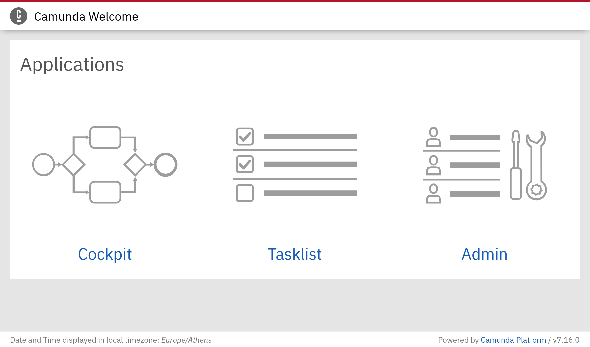
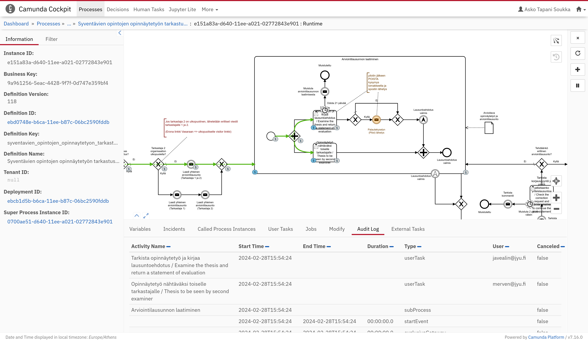
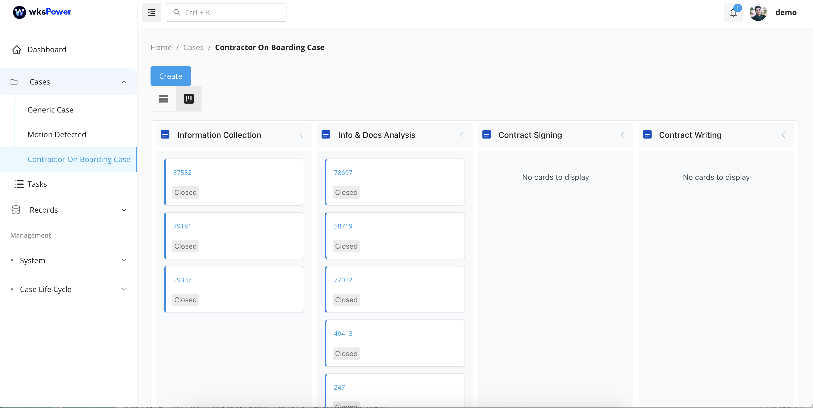
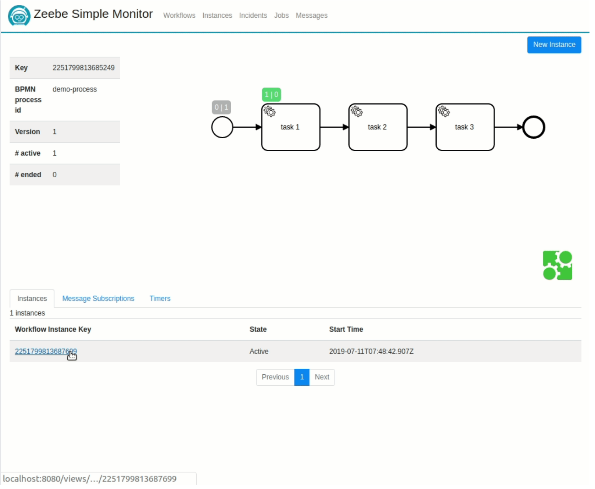

##

{width="85%"}

## {.standout}

::: columns
::: {.column width="40%"}
* Camunda
* Chapter:
* Finland
:::

::: {.column width="55%"}
{width="100%"}
:::
:::

# Camunda Modeler

## [Camunda Modeler](https://camunda.com/download/modeler/)

{width="80%"}

## Camunda Modeler Plugins

{width="80%"}

## [Camunda Modeler](https://camunda.com/download/modeler/)

* **License**: MIT
* **Plugins**:
  * [Token Simulation Plugin](https://github.com/camunda/camunda-modeler-token-simulation-plugin)
  * [Transaction Boundaries Plugin](https://github.com/camunda/camunda-modeler-plugins/tree/main/camunda-transaction-boundaries-plugin)
  * [Embedded Comments Plugin](https://github.com/datakurre/camunda-modeler-embedded-comments-plugin)
  * [Property Info Plugin](https://github.com/mesoneer-ag/camunda-modeler-property-info-plugin)
  * [Resize Tasks Plugin](https://github.com/philippfromme/camunda-modeler-plugin-resize-tasks)

[https://github.com/camunda/camunda-modeler-plugins](https://github.com/camunda/camunda-modeler-plugins)

# bpmn.io

## [bpmn.io](https://bpmn.io/)

**Web-based tooling for BPMN, DMN and Forms**

::: columns
::: {.column width="48%"}
* [bpmn-js](http://demo.bpmn.io/)
* [dmn-js](http://demo.bpmn.io/dmn)
* [form-js](http://demo.bpmn.io/form)
* [nikku/feelin](https://nikku.github.io/feel-playground/)
* [cmmn-js](http://demo.bpmn.io/cmmn)
:::

::: {.column width="48%"}
{width="100%"}
:::
:::

## bpmn.io + JupyterLab

**BPMN, DMN and Forms in Jupyter notebooks**

::: columns
::: {.column width="48%"}
* [jupyterlab-bpmn](https://github.com/datakurre/jupyterlab-bpmn)
* [jupyterlab-dmn](https://github.com/datakurre/jupyterlab-dmn)
* [jupyterlab-form-js](https://github.com/datakurre/jupyterlab-form-js)
:::

::: {.column width="48%"}
{width="100%"}
:::
:::

## Sphinx documentation

[{width="80%"}](https://datakurre.github.io/automation-playground)

# Camunda 7

## Camunda 7

**Camunda 7 Community Edition**

::: columns
::: {.column width="48%"}
* **License**: Apache 2.0
* "Open Core"
* **Distributions**:
  * [Camunda Run](https://camunda.com/download/platform-7/)
  * [Tomcat](https://camunda.com/download/platform-7/)
  * [Docker](https://hub.docker.com/r/camunda/camunda-bpm-platform)
  * [SpringBoot](https://start.camunda.com/)
  * [Micronaut (unofficial)](https://github.com/camunda-community-hub/micronaut-camunda-platform-7)
:::

::: {.column width="48%"}
{width="100%"}
:::
:::

## Camunda 7 Plugins

**Camunda 7 Webapps Plugins**

::: columns
::: {.column width="48%"}
* [Minimal History](https://github.com/datakurre/camunda-cockpit-plugins)
* [JupyterLite](https://github.com/datakurre/camunda-cockpit-plugin-jupyter)
* [form.io-forms](https://github.com/StephenOTT/camunda-formio-plugin)

**Other**

* [Cammand](https://github.com/StephenOTT/Cammand)
:::

::: {.column width="48%"}
{width="100%"}
:::
:::

## Camunda 7 Platforms

**Camunda 7 Based Platforms**

::: columns
::: {.column width="48%"}
* [WKS Platform](https://www.wkspower.com/)
* [digiWF](https://digiwf.oss.muenchen.de/)
* [AgileKIP](https://github.com/AgileKip) (on-hold)
* [Digital State](https://digitalstate.io/)
* [Vasara](https://gitlab.com/vasara-bpm/vasara)
* [Plone-integration](https://datakurre.pandala.org/2022/10/collective-bpmproxy/)
:::

::: {.column width="48%"}
{width="100%"}
:::
:::

## Camunda 7 EOL

* Camunda 7 CE will EOL (end of life) in October 2025
* Final release (v7.24), happening on Oct 14, 2025
* GitHub repo will be archived, deprecated
* Artifacts on Maven Central will no longer be maintained

*Camunda 7 Enterprise Edition (EE) will EOL in April 2030*

# Zeebe (Camunda 8)

## Camunda 8 Licensing

* **Zeebe** – Zeebe Community License 1.1
* **Connector SDK** – Apache 2.0
* **Camunda Webapps** – proprietary
* **Camunda Connectors** – proprietary

## Camunda 7 vs. Zeebe

::: columns
::: {.column width="48%"}
### Camunda 7
* Apache 2.0
* Full stack
* Standalone
* Transactional
* Integratable
* REST API + long-poll
* Customizable
:::

::: {.column width="48%"}
### Zeebe
* Custom
* Only engine
* Cluster
* Event-driven
* External service
* gRPC + exporters
* Opinionated
:::
:::

## Zeebe OSS picks

::: columns
::: {.column width="50%"}
* [zeebe-keycloak-interceptor](https://github.com/camunda-community-hub/zeebe-keycloak-interceptor)
* [zeebe-jwt-interceptor](https://gitlab.com/vasara-bpm/zeebe-jwt-interceptor)
* [zeebe-redis-exporter](https://github.com/camunda-community-hub/zeebe-redis-exporter)
* [zeebe-simple-monitor](https://github.com/camunda-community-hub/zeebe-simple-monitor)
* [zeeqs (GraphQL API)](https://github.com/camunda-community-hub/zeeqs)
* [Parrot RCC](https://github.com/datakurre/parrot-rcc)
:::

::: {.column width="46%"}
{width="100%"}
:::
:::

## {.standout}

[Open Automation Playground](https://datakurre.github.io/automation-playground)
