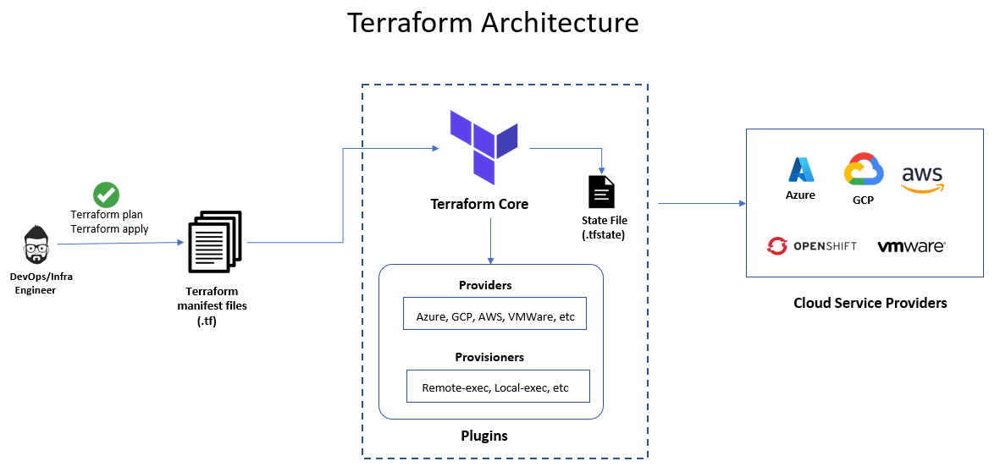
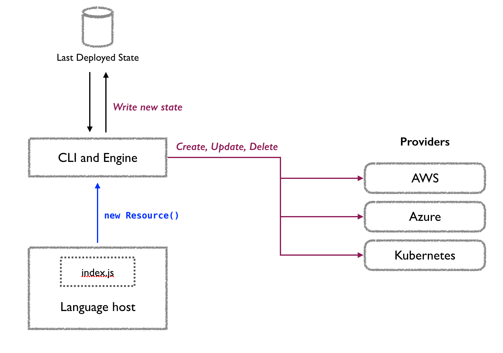

# Infrastructure as Code

## Terraform language syntax

```hcl
resource "vsphere_virtual_machine" "vm" {
  name             = "foo"
  resource_pool_id = data.vsphere_compute_cluster.cluster.resource_pool_id
  datastore_id     = data.vsphere_datastore.datastore.id
  num_cpus         = 1
  memory           = 1024
  guest_id         = "other3xLinux64Guest"
  network_interface {
    network_id = data.vsphere_network.network.id
  }
  disk {
    label = "disk0"
    size  = 20
  }
}
```

##

{width="85%"}

# With Pulumi

##

{width="85%"}

## Pulumi resource in Python

```python
virtual_machine = vsphere.VirtualMachine("vm",
    name="foo",
    resource_pool_id="your_resource_pool_id",
    datastore_id="your_datastore_id",
    num_cpus=1,
    memory=1024,
    guest_id="other3xLinux64Guest",
    network_interfaces=[vsphere.VirtualMachineNetworkInterfaceArgs(
        network_id="your_network_id",
    )],
    disks=[vsphere.VirtualMachineDiskArgs(
        label="disk0",
        size=20,
    )],
)
```

## Pulumi resource in YAML

```yaml
resources:
  vm:
    type: vsphere:index/virtualMachine:VirtualMachine
    properties:
      name: foo
      resourcePoolId: ${resourcePool.id}
      datastoreId: ${datastore.id}
      numCpus: 1
      memory: 1024
      guestId: other3xLinux64Guest
      networkInterfaces:
        - networkId: ${network.id}
      disks:
        - label: disk0
          size: 20
```

## Pulumi automation API

```python
# Create and deploy stack with dynamic Pulumi program
pulumi.automation.create_or_select_stack(
    stack_name="test",
    project_name="proxy",
    program=...,
    opts=pulumi.automation.LocalWorkspaceOptions(
        project_settings=pulumi.automation.ProjectSettings(
            name="proxy",
            runtime="python",
            backend=...
        ),
        secrets_provider=...
    ),
).up() # Go!
```

## Accessing asynchronous outputs

```python
# Define any resource
secret_id = vault.approle.AuthBackendRoleSecretId(
    f"{approle.name}:{machine.name}",
    role_name=approle.name,
    with_wrapped_accessor=True,
    wrapping_ttl="24h",
)

# Use future to access and use output when available
pulumi.export(
    f"approle:{approle.name}:{machine.name}:state",
    secret_id.wrapping_accessor.apply(lambda accessor: ...)
)
```

## Accessing previous state

```python
# Retrieve previous state with dummy program
state = pulumi.automation.create_or_select_stack(
    program=lambda: None,
    ...
).export_stack()

# Final stack with real program and previous state
stack = pulumi.automation.create_or_select_stack(
    program=create_program(state),
    ...
)
stack.up()
```

# MVRE & Pulumi

## MVRE NixOS configuration

```nix
{ config, ... }: {
  imports = [ ./miniotest0.nix ];

  fileSystems."/var/persist".device = "/dev/disk/by-uuid/...";
  fileSystems."/var/lib/minio".device = "/dev/disk/by-uuid/...";

  networking.hostName = "mvre-miniotest1";
  networking.interfaces."intraserv-2" = {
    ipv4.addresses = [{ address = "..."; prefixLength = 23; }];
    macAddress = "...";
  };

  services.udev.extraRules = ''
    ACTION=="add", SUBSYSTEM=="net", ATTR{address}=="${config.networking.interfaces.intraserv-2.macAddress}", NAME="intraserv-2"
  '';
}
```

## MVRE Nix to Pulumi mapping

```toml
[minio.test]
disks = [
    { name = "miniotest1./", datastore = "mvre_01_200" },
    { name = "miniotest2./", datastore = "mvre_01_200" },
    { name = "miniotest3./", datastore = "mvre_02_201" },
    { name = "miniotest4./", datastore = "mvre_02_201" },
]
machines = [
    { name = "miniotest1", datastore = "mvre_01_200", host = "aatos-l40s.cc.jyu.fi" },
    { name = "miniotest2", datastore = "mvre_01_200", host = "erkko-l40s.cc.jyu.fi" },
    { name = "miniotest3", datastore = "mvre_02_201", host = "jane-a30.cc.jyu.fi" },
    { name = "miniotest4", datastore = "mvre_02_201", host = "jane-a30.cc.jyu.fi" },
]
```

## MVRE Pulumi CLI

```shell
Usage: mvre.py [OPTIONS] PULUMI_PROJECT PULUMI_STACK COMMAND [ARGS]...

  MVRE Pulumi CLI

Options:
  --preview  Require confirmation before proceeding.
  --cancel   Cancel Pulumi lock on stack.
  --help     Show this message and exit.

Commands:
  down
  up
```

## MVRE Pulumi Program

```python
def create_pulumi_program(
    project: ProjectStack,
    catalog: FlakeCatalog,
    vault_addr: str,
) -> None:
    disks: Dict[str, vsphere.File] = {}

    for disk in project.disks:
        disks[resource_name(disk.name)] = vsphere_file(disk, catalog)

    for machine in project.machines:
        vsphere_virtual_machine(machine, catalog, vault_addr, disks)
```

## {.standout}

{width="50%"}
