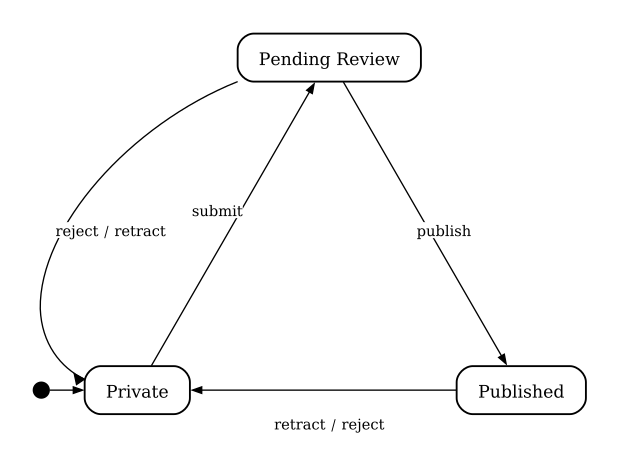
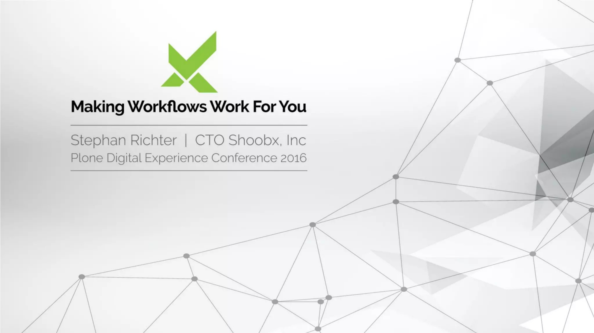
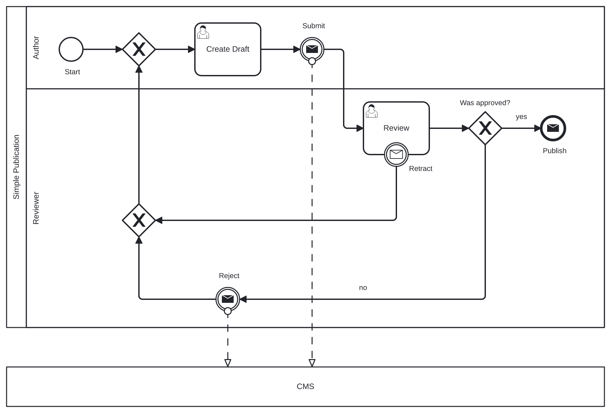
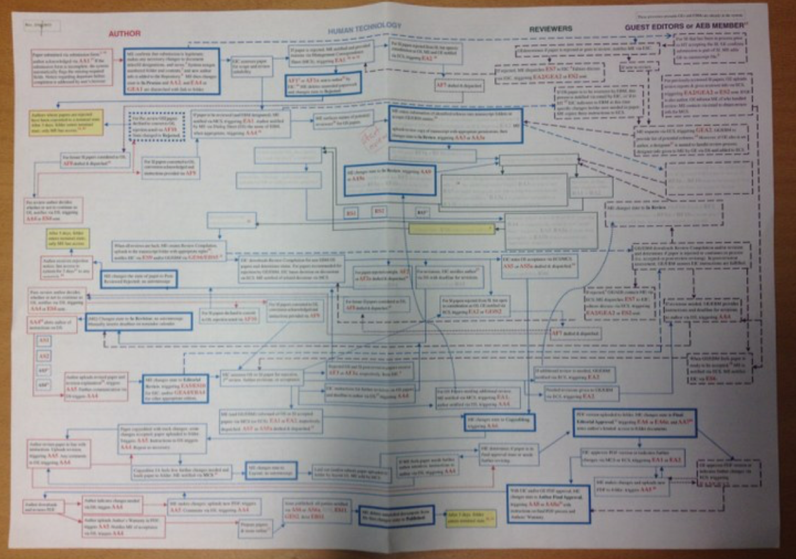
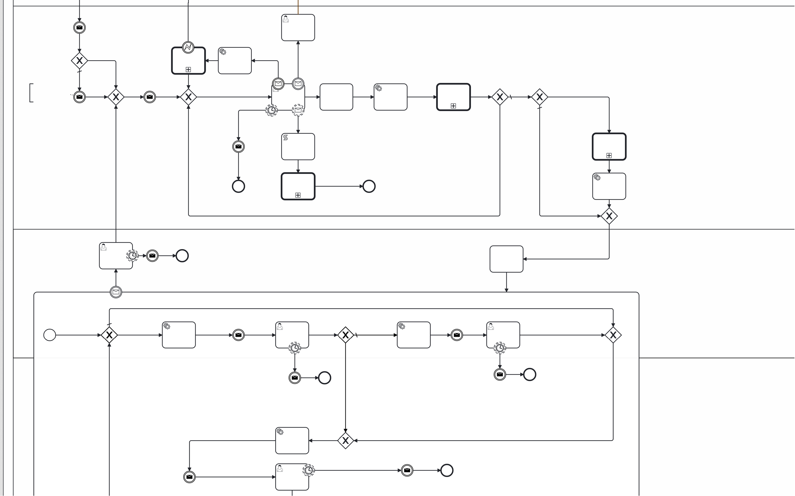
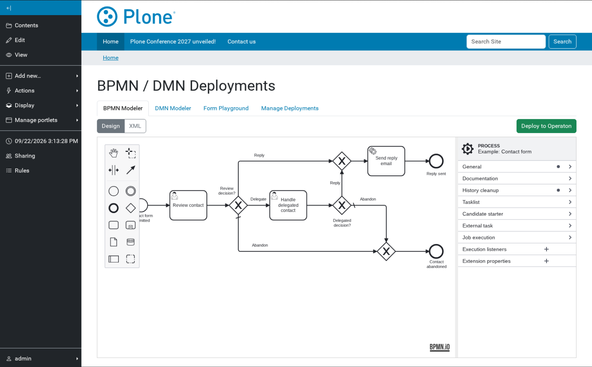
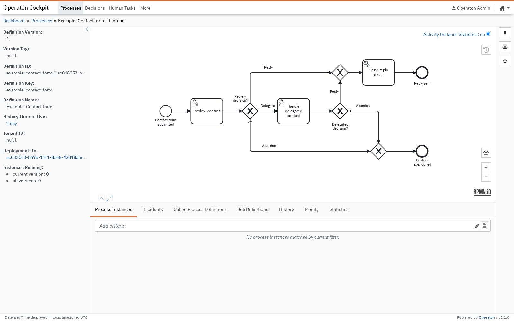

# Introduction {.section-slide}

## State vs. Activity-Based Workflows

::: columns
::: {.column width="50%"}

:::
::: {.column width="50%"}

:::
:::

## Asko Soukka

::: columns
::: {.column width="30%"}

:::
::: {.column width="65%"}
- Software Architect at University of Jyväskylä, Finland
- Long-time open-source Python and Plone developer
- Building CMS integrations, digital services, and process automation
- BPMN-based process orchestration in production since 2020
:::
:::

## Agenda for Today

{animated="true" height="75%"}

---

# State or Activities {.section-slide}

## Previously on...

::: {.diagram-caption}
[Stephan Richter, Plone Conf 2016, Making Workflows Work For You](https://www.youtube.com/watch?v=Zu5P53_Pg0E)
:::

## State-Based Workflows

::: columns
::: {.column width="50%"}

:::
::: {.column width="50%"}
- States and transitions
- Events on transitions
- Chainable and placeful
- Tied to content objects
:::
:::

## Activity-Based Workflows

::: columns
::: {.column width="40%"}

:::
::: {.column width="60%"}
- Activities, sequence flows and gateways
- Intermediate and boundary events
- Call activities, sub-processes and pools
- Process instances and tokens
:::
:::

## The Same, but Different

{simulator="true"}

## State May Not Be Enough

- **Concurrency**
  - Several actors can work at the same time
- **Timeouts & Events**
  - The process waits for a deadline or webhook
- **Branching & Merging**
  - Decisions create independent parallel paths
- **Task Data & Integrations**
  - Task-specific forms and temporary integrations

## State May Not Be Enough

---

# BPMN 2.0 Primer {.section-slide}

## What is BPMN 2.0?

- **Business Process Model and Notation** (OMG standard)
- A visual language understood by business analysts and domain experts
- An executable XML format with strict operational semantics
- Eliminates translation gaps between specification and production code

The diagram is not just documentation. The diagram is the program.

**The diagram is code.**

## Sequence Flow

-  **Start events** begin a process instance
-  **End events** finish a path or terminate the instance
-  **Activities** represent work to be performed
- Flow connects events and activities into an executable path

{width="60%"}

## Activities

- Activities represent work performed by a person, script, service or process
- The activity type communicates who or what performs the work
- Each activity receives and passes execution onward through sequence flows

{height="45%"}

## Token Concept

{animated="true" width="60%"}

- When a process starts, a **token** is generated at the start event
- The token travels along sequence flows into activities
- When an activity completes, the token moves forward
- Gateways can split one token into multiple parallel tokens or merge them
- The instance ends when all active tokens are consumed

## Exclusive Gateways

**Exclusive gateways**  choose one path.

{simulator="true"}

## Parallel Gateways

**Parallel gateways**  run paths in parallel.

{simulator="true"}

## Inclusive Gateways

**Inclusive gateways**  activate every matching path.

{simulator="true"}

## Timer Boundary Events

::: columns
::: {.column width="50%"}
**Interrupting timers**  can time out activities and reroute execution.

{simulator="true"}
:::

::: {.column width="50%"}
**Non-interrupting timers**  spawn extra tokens at scheduled intervals.

{simulator="true"}
:::
:::

## Error and Message Boundary Events

::: columns
::: {.column width="50%"}
**Error events**  route "business errors" to recovery paths.

{simulator="true"}
:::
::: {.column width="50%"}
**Message events**  interrupt tasks when external messages are received.

{simulator="true"}
:::
:::

## External Service Task Pattern

::: columns
::: {.column width="58%"}
{simulator="true"}
:::
::: {.column width="38%"}
- The engine creates a task for the configured topic
- A worker fetches and locks the service task
- The worker executes the automation and completes the task
- The engine handles retries and failure incidents
:::
:::

**Decoupled execution**. Workers can run anywhere and scale horizontally.

## No Silver Bullet

::: columns
::: {.column width="85%"}
{border="1px"}
:::

::: {.column width="15%"}
{width="100%" border="1px"}
:::
:::

---

# (FL)OSS Ecosystem {.section-slide}

## BPMN.io

Web-native, extensible tools built and maintained by Camunda and contributors:

::: columns
::: {.column width="48%"}
- **`bpmn-js`**: Web-based BPMN modeler and viewer
- **`@bpmn-io/form-js`**: JSON-based form editor, viewer and playground
- **`dmn-js`**: DMN editing and rendering for decision tables
:::

::: {.column width="48%"}
{border="1px"}
:::
:::

MIT-style bpmn.io license with a mandatory watermark. MIT-licensed plugins.

## Operaton

::: columns
::: {.column width="60%"}
- Apache 2.0-licensed BPMN 2.0 engine
- Community fork of Camunda 7 CE
- Java runtime, Spring-extensible
- Engine, REST API, Web UI
- [start.operaton.org](https://start.operaton.org/)
- [hub.docker.com/r/operaton/operaton](https://hub.docker.com/r/operaton/operaton)
:::

::: {.column width="50%"}
{border="1px"}
:::
:::

## Beyond BPMN.io and Operaton

Different histories and product models; BPMN XML is the common boundary.

- **[jBPM / Apache KIE](https://github.com/kiegroup/jbpm)**: Since 2003; Apache 2.0 Java toolkit with Business Central and Eclipse tooling for modeling, executing and monitoring processes, cases and decisions
- **[Flowable](https://github.com/flowable/flowable-engine)**: Since 2016; Apache 2.0 engines and open-source UI apps, surrounded by a company-led commercial platform; shares Activiti ancestry with Camunda 7
- **[SpiffWorkflow + SpiffArena](https://github.com/sartography/spiff-arena)**: BPMN support since 2020; SpiffArena v1.0 in 2025; LGPLv3 Python BPMN/DMN runtime plus an open-source full-stack web app whose editor extends `bpmn-js`

---

# Demos {.section-slide}

## Engine-Driven

{simulator="true"}

## Content-Driven

{simulator="true"}

## Case Management

::: columns
::: {.column width="50%"}
{simulator="true"}
:::
::: {.column width="50%"}
{simulator="true"}
:::
:::

## Under Construction

### [github.com/collective/collective.bpmproxy](https://github.com/collective/collective.bpmproxy)

::: columns
::: {.column width="32%"}
{width="70%" align="center"}
:::
::: {.column width="63%"}
- BPM Proxy -content type with form views (Blicca)
- Message and Signal content rule actions
- Tasklist portlet with task form vies (Blicca)
- Modeling and deployment controle panel (Blicca)
- Example stack with Operaton, PostgreSQL, Keycloak and browser smoke tests
:::
:::

---

# Thank you! {.section-slide}
