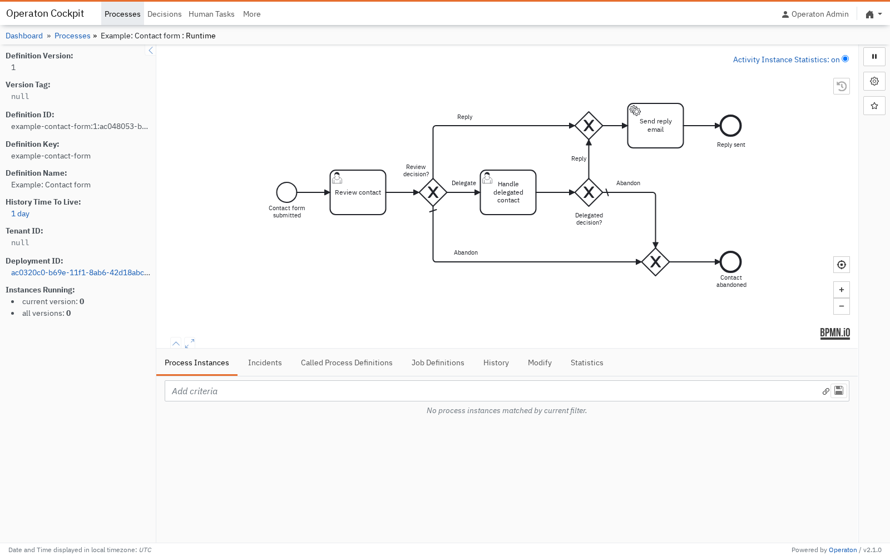

# Introduction {.section-slide}

## Automation Control Plane

{simulator="true"}

## Asko Soukka (RFCP®)

::: columns
::: {.column width="30%"}

:::
::: {.column width="60%"}
- Software Architect at University of Jyväskylä, Finland
- Decades of experience in open-source Python development
- CMS deployments, microservices, Robot Framework tasks and tests
- BPMN-based automation and process orchestration since 2020
:::
:::

## Robot Framework for RPA

- From test automation to RPA
- Keywords make complex actions readable
- Execution logs make automation auditable
- An open ecosystem for almost any system
- [robotframework.org/rpa](https://robotframework.org/rpa)

## Orchestration Challenge

- A task is easy, a process is not
- Real work needs state, branching, and waiting
- Real work crosses systems and includes humans
- BPMN makes the flow visible and executable

## Agenda

- BPMN 2.0: model executable processes
- Operaton: run the process and queue the work
- Robot Worker: execute Robot Tasks with Purjo
- Hello World: build and run a task package
- Testing orchestrated automation end to end

---

# BPMN 2.0 {.section-slide}

## What is BPMN 2.0?

- Business Process Model and Notation (ISO/IEC 19510)
- A standard language for executable processes
- Visual for people, precise for engines
- A mature ecosystem of tools and runtimes

The diagram is not just documentation. The diagram is the program.

**The diagram is code.**

## Sequence Flow

-  **Start Event**: something triggers the process
-  **Activities**: the work happens
-  **End Event**: the process reaches an outcome

{height="80%" align="center" simulator="true"}

## Activities

- Activities represent work performed by a person, script or service
- The activity type communicates who or what performs the work
- Each activity receives and passes execution onward through sequence flows

{height="45%"}

## Token Concept

{animated="true" width="60%"}

- A process instance starts with a **token** at the start event
- The token travels along sequence flows into activities
- Gateways split tokens into parallel paths or merge them
- The instance ends when all active tokens are consumed

## Exclusive Gateways

An [exclusive gateway]{.bpmn-symbol type="exclusiveGateway"} evaluates conditions and chooses one path.

{simulator="true"}

## Parallel Gateways

A [parallel gateway]{.bpmn-symbol type="parallelGateway"} activates every outgoing path.

{simulator="true"}

## Inclusive Gateways

An [inclusive gateway]{.bpmn-symbol type="inclusiveGateway"} activates every matching path.

{simulator="true"}

## Timer Boundary Events

::: columns
::: {.column width="50%"}
**Interrupting timers**  time out work and reroute execution.

{simulator="true"}
:::

::: {.column width="50%"}
**Non-interrupting timers**  spawn extra tokens.

{simulator="true"}
:::
:::

## Error and Message Boundary Events

::: columns
::: {.column width="50%"}
**Error events**  route business errors to recovery paths.

{simulator="true"}
:::
::: {.column width="50%"}
**Message events**  interrupt work when an message arrives.

{simulator="true"}
:::
:::

## One more BPMN example

{simulator="true"}

---

# Process Engine {.section-slide}

## Why BPMN for Developers?

- Visual communication language for everyone
- **BPMN / Engine** controls flow and state
- **Robot Framework** implements task automation
- Small workers stay focused and reusable
- The engine provides tools and logs

## Introducing Operaton

::: columns
::: {.column width="66%"}
- Apache 2.0-licensed BPMN 2.0 engine
- Community fork of Camunda 7 CE
- Java runtime, Spring-extensible
- Engine, REST API, Web UI
- [start.operaton.org](https://start.operaton.org/)
- [Docker image `operaton/operaton`](https://hub.docker.com/r/operaton/operaton)
:::

::: {.column width="40%"}
{border="1px"}
:::
:::

## The External Task Pattern

::: columns
::: {.column width="50%"}
- Engine queues work by topic
- Workers fetch and lock
- Workers complete or fail
- Engine retries and raises incidents
:::
::: {.column width="50%"}
{simulator="true"}
:::
:::

**Decoupled execution**: workers run anywhere and scale out.

---

# Robot Worker {.section-slide}

## Robot Tasks as Service Tasks

-  Service Tasks can be Robot tasks
- Operaton owns state; Robot owns task execution
- Operaton queues work under **topics**
- Serice Task workers poll, fetch and complete tasks
- Tasks "communicate" using process variables

## Introducing Purjo

- Purjo worker connects Operaton topics to Robot tasks
- Isolated environments provided via `uv`
- Topic mappings live in `pyproject.toml`
- Injects variables and secrets; adds return scope

{height="80%" align="center" simulator="true"}

## Purjo `hello.robot`

- Purjo tasks are vanilla `.robot`:

  ```robotframework
  *** Variables ***
  ${BPMN:PROCESS}     local
  ${name}             n/a

  *** Tasks ***
  My Task in Robot
      Log To Console        Hello ${name}!
      VAR    ${greeting}    Hello ${name}!    scope=${BPMN:PROCESS}
  ```

## Purjo `pyproject.toml`

```toml
[project]
dependencies = [
    "robotframework>=7.2.2",
]

[dependency-groups]
dev = [
    "robotframework-robotlibrary>=1.0a3",
]

[tool.purjo.topics."My Topic in BPMN"]
name = "My Task in Robot"
process-variables = true
```

## Implicit Process Variable Mapping

- Process variables arrive as Robot variables
- File variables arrive as absolute paths

  ```robotframework
  *** Variables ***
  ${name}               ${EMPTY}

  *** Tasks ***
  My Task in Robot
      Log to Console    Hello    ${name}
  ```

## Returning Variables to the Process

- Purjo patches Robot with `VAR` scope `BPMN:PROCESS`
- Operaton receives them when the task completes
- Vanilla `robot` supported by`${BPMN:PROCESS}` indirection

  ```robotframework
  *** Variables ***
  ${BPMN:PROCESS}     local

  *** Tasks ***
  My Task in Robot
      VAR    ${greeting}    Hello World!    scope=${BPMN:PROCESS}
  ```

---

# Hello World {.section-slide}

## Running Operaton with Podman

- Build Operaton with community UI plugins

  ```bash
  curl -fsSL https://raw.githubusercontent.com/\
  datakurre/operaton-cockpit-plugins/main/\
  Dockerfile | docker build -t operaton-with-plugins -
  ```

- Run the built image

  ```bash
  docker run --rm -p 8080:8080 operaton-with-plugins
  ```

- Operaton UI credentials: `demo` / `demo`


## Creating a Purjo Task Package

- Scaffold the task, project configuration and example process

  ```bash
  mkdir hello-world
  cd hello-world

  uv run --with=purjo -- pur init --task --agents
  ```

- Deploy a BPMN and start an instance

  ```bash
  uv run --with=purjo -- pur run hello.bpmn
  ```

## Serving a Purjo Task Package

- Poll for the configured topics for tasks
- Run tasks using `uv` in a temporary directory
- Return the logs and results to process

  ```bash
  uv run --with=purjo -- pur serve . --log-level=DEBUG
  ```

---

# Demo {.section-slide}

---

# Testing {.section-slide}

## E2E Testing with the `purjo` Library

* Acceptance tests requires running process engine:

  ```robotframework
  *** Settings ***
  Library    purjo
  Library    Collections

  *** Test Cases ***
  Test Topic Execution
      &{inputs}=         Create Dictionary         name=Alice
      &{outputs}=        Get Output Variables      path=.
      ...                topic=My Topic in BPMN    variables=${inputs}
      Should Be Equal    ${outputs}[greeting]      Hello Alice!
  ```

## Testing Task with `RobotLibrary`

* `RobotLibrary` executes just `.robot`:

  ```robotframework
  *** Settings ***
  Library    RobotLibrary

  *** Test Cases ***
  Test Hello Task
      Run Robot Task     hello.robot    My Task in Robot
      ...                BPMN:PROCESS=global
      ...                name=Alice
      Should Be Equal    ${greeting}    Hello Alice!
  ```

## Testing BPMN with `Operaton` Library

```robotframework
*** Settings ***
Library    Operaton

*** Test Cases ***
Hello Process Completes External Task
    [Setup]                   Setup Process Engine
    Deploy Resources          ${CURDIR}${/}hello.bpmn
    Start Instance            example-hello-world
    ${tasks}=                 Fetch And Lock    My Topic in BPMN
    ${task_id}=               Get From List     ${tasks}    0
    Complete External Task    ${task_id}        message=Hello Alice!
    Should Be Ended
    [Teardown]                Teardown Process Engine
```

::: notes
[`robotframework-operaton`](https://gitlab.com/vasara-bpm/robotframework-operaton)
:::

---

# Summary {.section-slide}

## Summary and Resources

::: columns
::: {.column width="40%"}
- Robot Framework for task automation
- BPMN and Operaton for control plane
- Purjo bridges BPMN tasks to Robot
- Operaton and bpmn.io ecosystems
:::
::: {.column width="60%"}
- Operaton: [operaton.org](https://operaton.org)
- Purjo: [pypi.org/project/purjo](https://pypi.org/project/purjo/)
- [bpmn.io](https://bpmn.io), search for "Opinionated BPMN 2.0 (bpmn-js) Modeler"
- [pypi.org/project/robotframework-robotlibrary](https://pypi.org/project/robotframework-robotlibrary/)
- [github.com/datakurre/robotframework-operaton](https://github.com/datakurre/robotframework-operaton)
:::
:::

---

# Thank you! {.section-slide}
